# C330 Storage — Process and Flow Charts

Visual diagrams for every workflow in Lessons 9 & 10. These render directly in GitHub, VS Code (with the Mermaid extension), and most modern Markdown viewers.

If your viewer doesn't render Mermaid, paste any diagram block at <https://mermaid.live/> to see it.

---

## 1. The Linux storage stack

How a file path resolves all the way down to physical sectors.

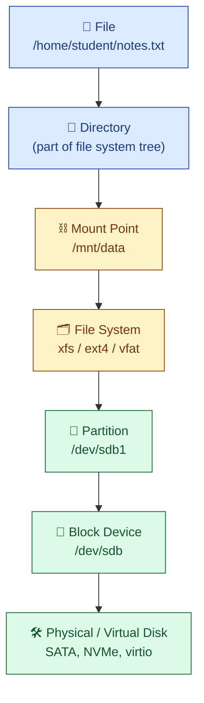

**Reading direction:** Top = what you (the user) see. Bottom = what the hardware sees. To create new storage, you build the layers **from the bottom up**.

---

## 2. The 8-step "add new storage" workflow

The master recipe in Lesson 10. Memorise this — every disk you ever add follows the same eight steps.

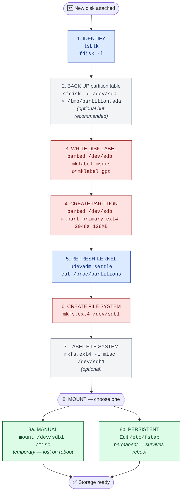

**Colour key:** 🔴 destructive steps (data loss risk) — 🔵 read-only or kernel steps — ⚪ optional best-practice — 🟢 final activation.

---

## 3. Decision tree — which partition scheme should I use?

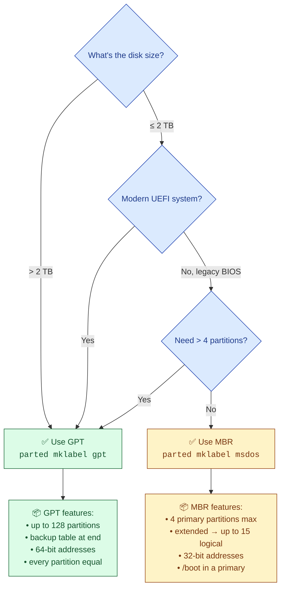

In modern environments **default to GPT** unless you have a specific reason (legacy bootloader, dual-boot with old Windows, etc.) to choose MBR.

---

## 4. MBR partition layout — extended + logical

How the 4-primary limit gets stretched to 15 partitions via extended/logical.

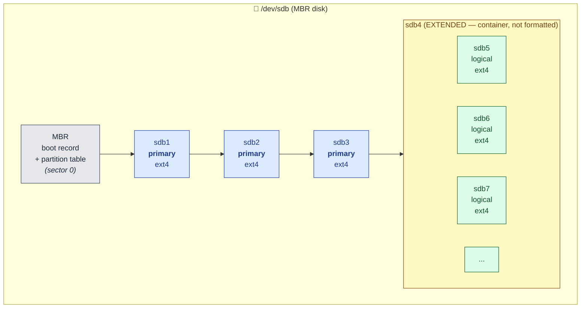

**Three rules to remember:**
- Only one extended container per disk.
- Extended partitions hold no file system — they are containers only.
- Logical partition numbering **always starts at 5**, even if you only have 1 primary.

---

## 5. GPT partition layout — all equal

By contrast, GPT has no extended/logical distinction.

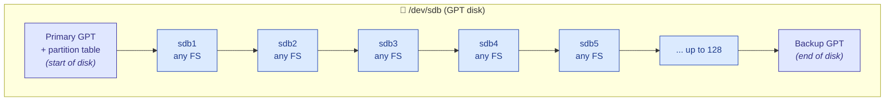

The **backup GPT** at the end of the disk is GPT's safety net — if the primary header is corrupted, the system can recover from this copy.

---

## 6. Mount lifecycle — manual vs persistent

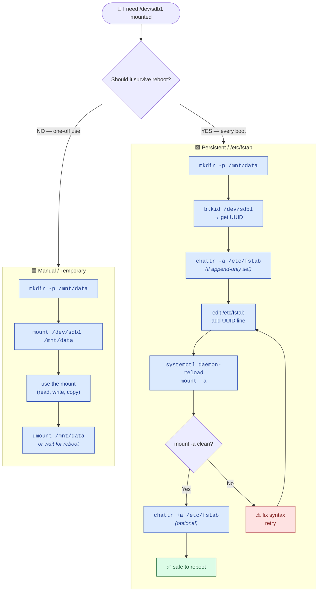

**The critical gate is `P6` — never reboot until `mount -a` returns no errors.** A broken `/etc/fstab` can prevent the system from starting.

---

## 7. `umount` troubleshooting flow

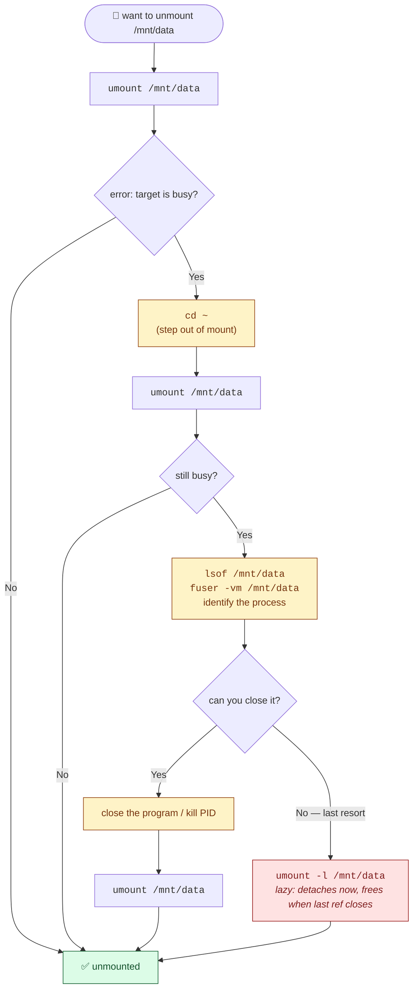

---

## 8. Cleanup flow — reverse of creation

When tearing down storage, **reverse the build order**: unmount → remove fstab entry → delete partition → erase label.

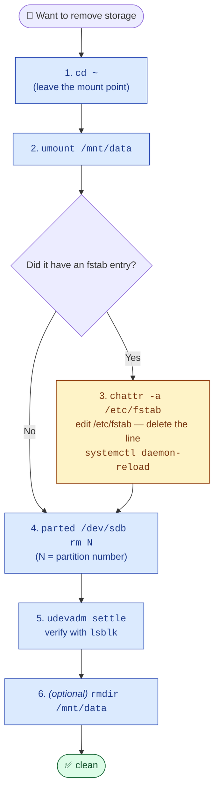

Doing this in the wrong order causes errors: deleting a partition while it's mounted breaks the mount; leaving an fstab entry for a deleted partition blocks the next boot.

---

## 9. Pre-flight safety check (mental model)

Before any destructive command, run this mental flowchart. Type the command only after every box says "✅".

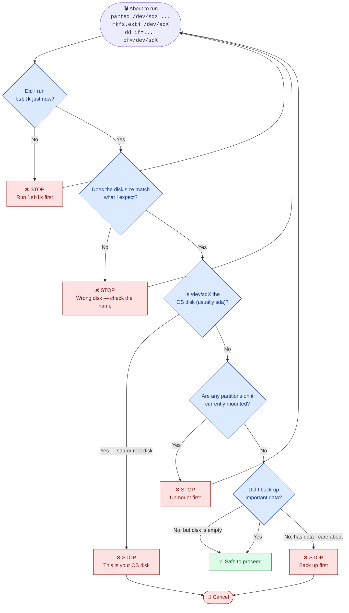

---

## 10. Where things live — the artefact map

How the file system, mount metadata, and kernel state relate.

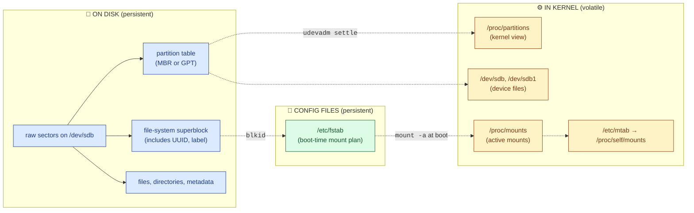

The blue boxes (disk) survive reboot. The yellow boxes (kernel state) are rebuilt on every boot from the blue and green sources. The green box (`/etc/fstab`) is the **link** that ties them together at startup.

---

## 11. Worksheet Q1 flow (Lesson 10)

End-to-end flow of the practical task.

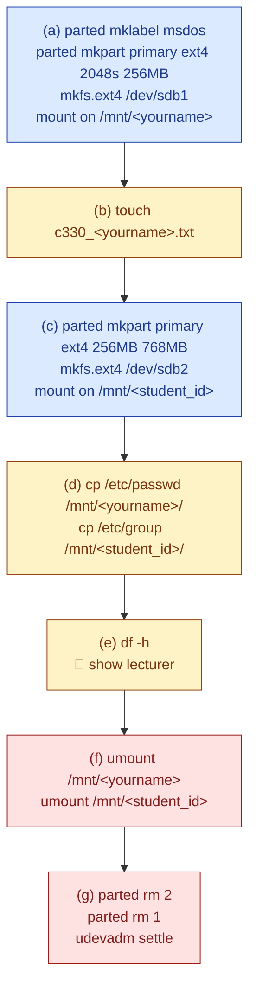

🔵 build phase → 🟡 test/use phase → 🔴 teardown phase. Notice the symmetry: every build step has a matching teardown step in reverse order.

---

## 12. Worksheet Q2 flow — persistent mount (Lesson 10)

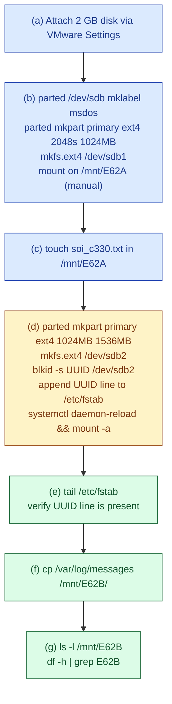

🔵 manual mount section → 🟡 the critical persistent-mount step → 🟢 verification.

---

## 13. Recovery from a broken /etc/fstab

If a bad fstab line stops the system from booting, this is the recovery path.

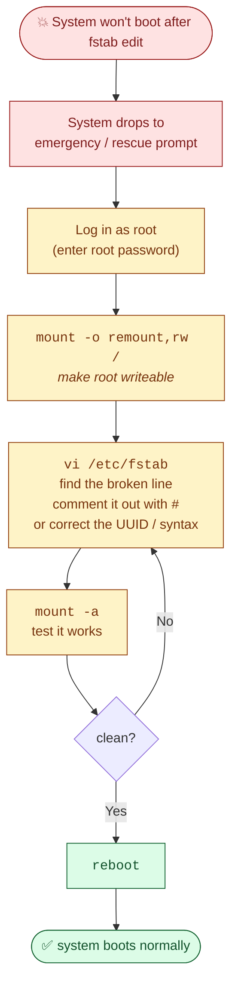

**Prevention is the best cure:** always run `sudo mount -a` *after* editing fstab and *before* rebooting. If `mount -a` is clean, your reboot is safe.

---

## 14. Tool decision matrix

Which command for which job?

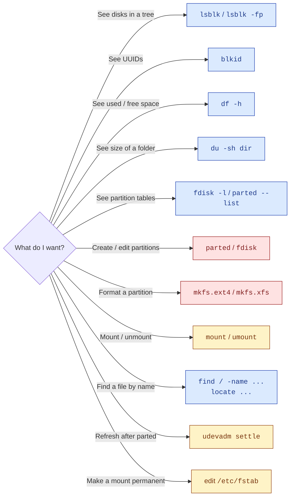

🔵 read-only — 🟡 modifies state — 🔴 destructive (can lose data).

---

## How to view these diagrams

**GitHub / GitLab / VS Code:** Markdown previewer renders Mermaid automatically. Just open `05_flow_charts.md`.

**Other Markdown viewers:** Install a Mermaid plugin, or copy any code block between ` ```mermaid` and ` ``` ` and paste into <https://mermaid.live/>.

**Export to image:** From <https://mermaid.live/> click *Export* → PNG/SVG.
